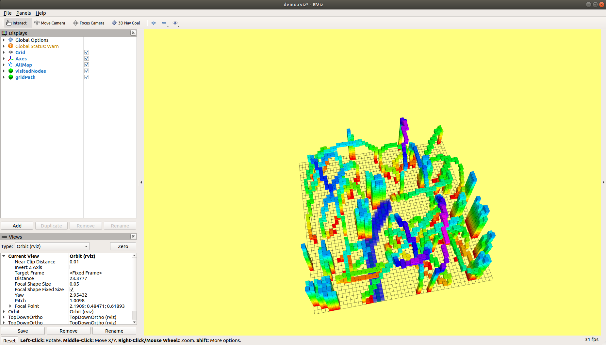
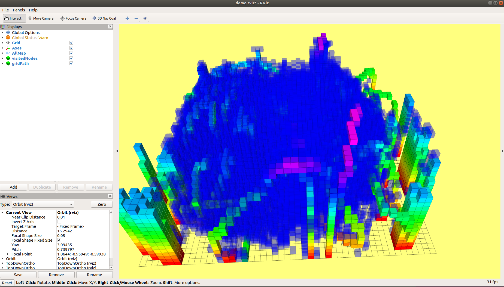
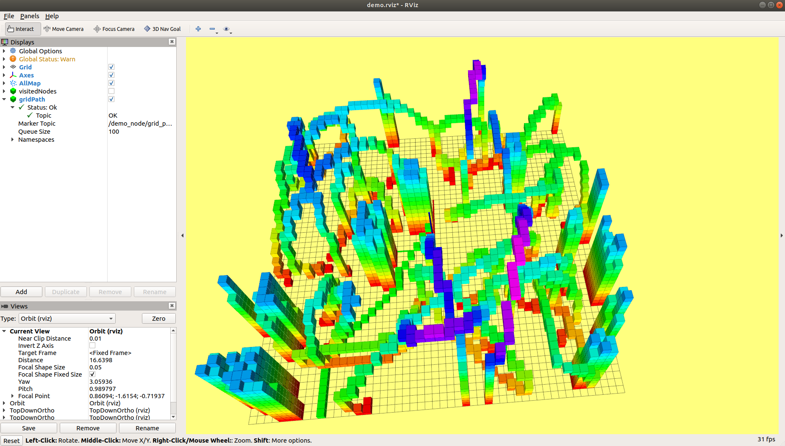
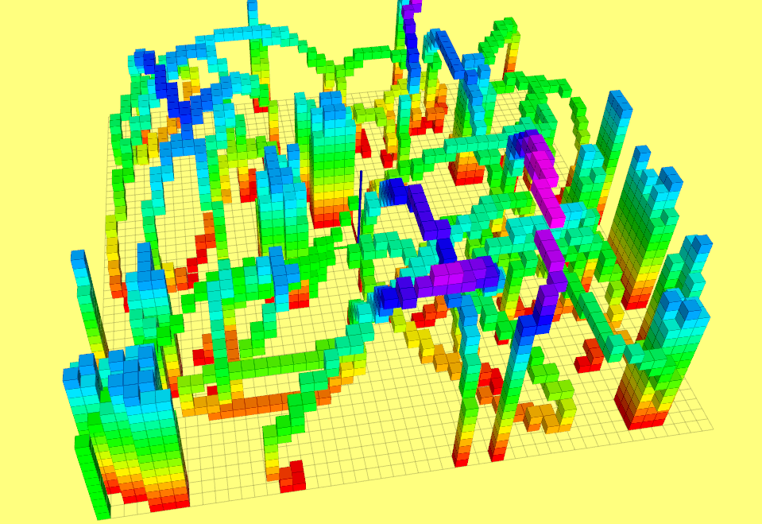
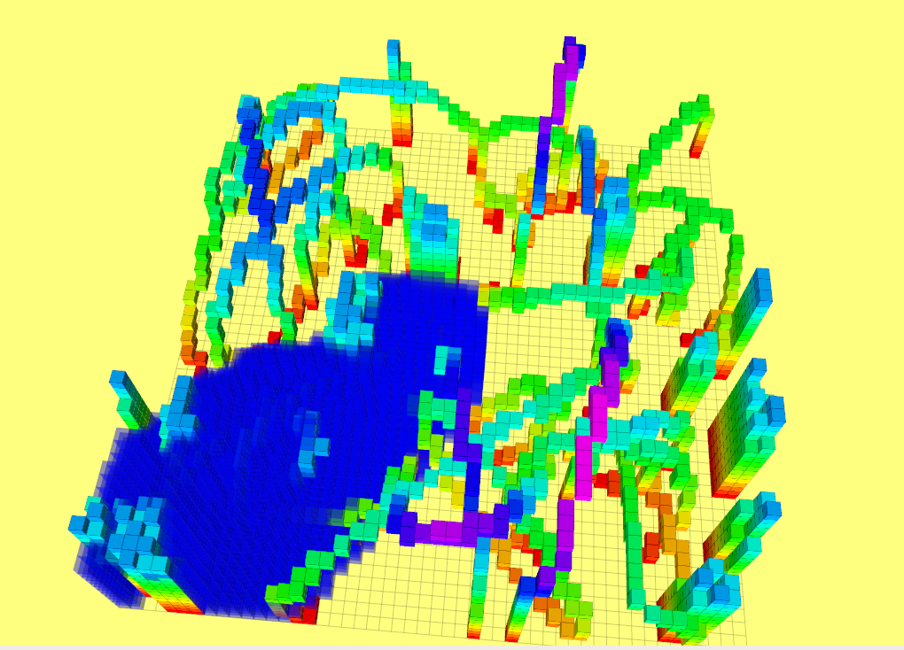
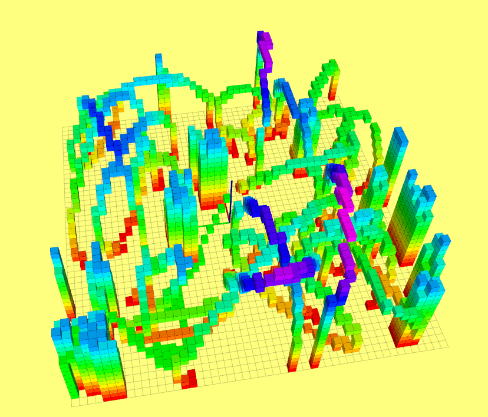
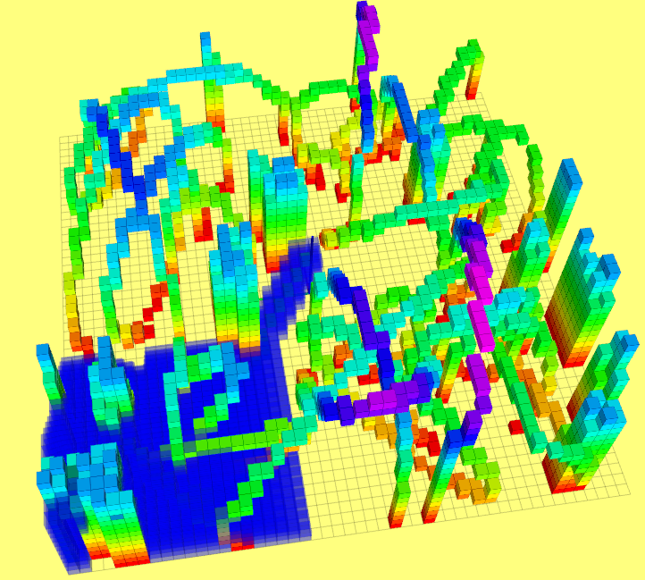

# grid_path_searcher
### Build and Run
Build this source code before running according to ROS melodic catkin_make tutorial..
Then run demo node

```
$source devel/setup.bash
$roslaunch grid_path_searcher demo.launch
```
What you will get after click on a valid goal grid

A\* algorithm showing all visited node


JPS algorithm showing all visited node


A\* algorithm showing planned path only

### Interesting Facts

Following pictures demonstrated that when obstacles step in the path from start point to goal point, A\* with Manhattan heuristics will find suboptimal path after searching a small space; while A\* with Euclidean heuristics will tend to find the optimal path after searching a larger space.


A\* using Euclidean Heuristic finds the optimal path

A\* using Euclidean Heuristic finds the optimal path searched 5317 grids



A\* using Manhattan Heuristic finds the suboptimal path

A\* using Manhattan Heuristic finds the suboptimal path searched 2384 grids